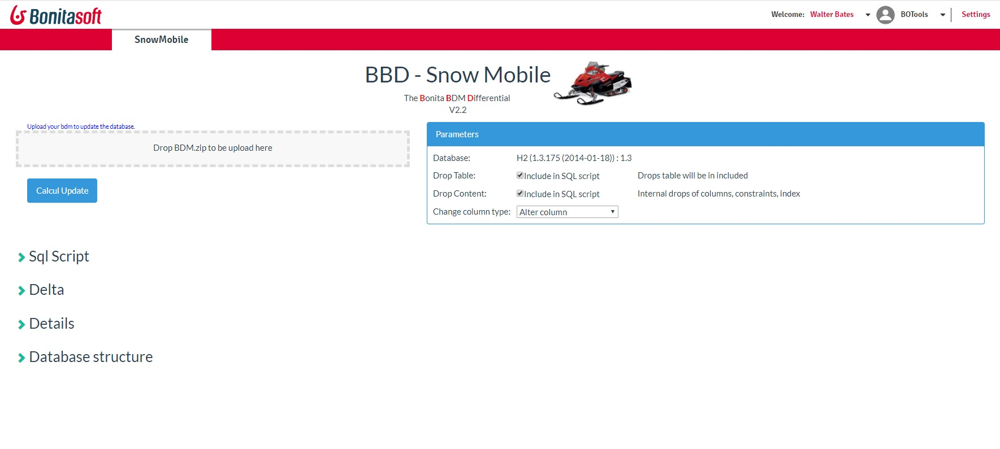

# page_snowmobile
Update the business database to fit the new Business Data Model.
Give the new BDM version, and the page compare the existing database structure, against the new definition. Then, a SQL Script is proposed to update the database. A comparaison is provided too.

